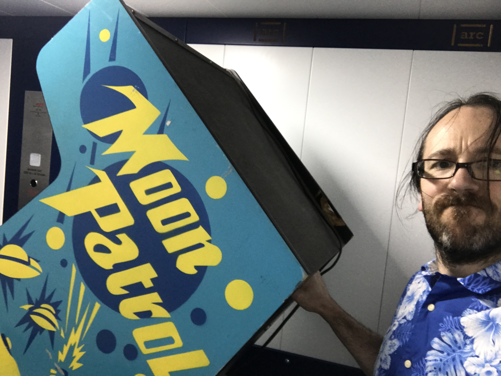
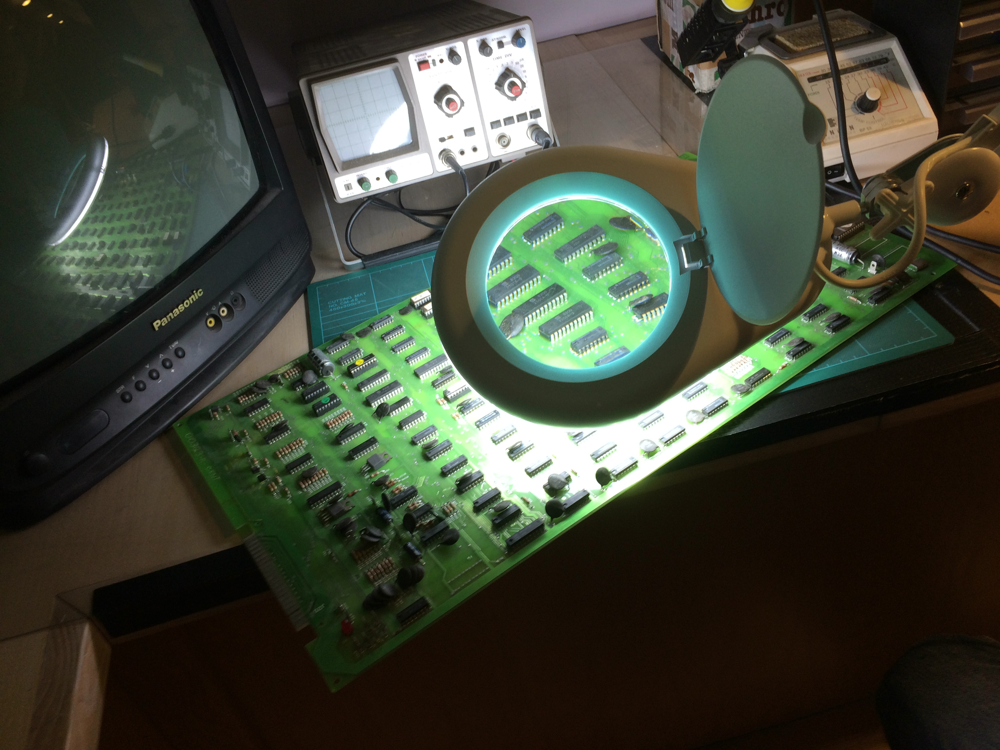

## **Who are you and what do you do?**

Hi! My name is Paul, and I'm (currently) a Web Platform Consultant. That's a
fluffy term to say that I wear many hats in my roles, but mainly I work in
Drupal Application development but on and off, I also moonlight as a Cloud
Infrastructure Architect/ Site Reliability Engineer/ System Administrator/
DevOps/ Test/ etc, etc
... Which I have been doing now for over 18 years.

I've been fortunate enough to have worked on many high-traffic websites and
complex web ecosystems throughout my career in web. However this is actually my
second career.
I dropped out of school at 17 and had a whirlwind career in finance, on the
[London International Financial Futures and Options Exchange][1].

Even though that was a very manual and physical job, I was never very far from
programming, and still coded a lot in my spare time.

I finally started a new career in web development in 2008, and have thoroughly
enjoyed it ever since.

## **What first got you into tech?**

I was probably around 9 or 10 when we got our first home computer; the
wonderful Sinclair ZX Spectrum 48K. I learnt a lot about programming at a
fairly young age by reading game code and trying to understand write-in's to
magazines. I taught myself Z80 assembly from a reference book I bought at a
book sale in a church hall and wrote a database in machine-code for my GCSE
project.

Part of my desire to learn was fuelled by my love of arcade machines. I always
hoped I'd learn enough to be able to create my own games at home, but I confess
the games I wrote back then were all pretty oddball and rubbish!

Anyways, none of that time was wasted as I've spent the last 25 years or so,
collecting and restoring arcade machines - so it's come in incredibly handy as
it's really helped with learning how to fix circuit boards/ games.

Plus, I'm also somewhat of a "Historian" for ZX Spectrum games and I like to
disassemble the code and publish it online using a toolkit called
[Skoolkit][3].

## What does your typical working day look like?

Lately I've been working as a Site Reliability Engineer for a major sports
betting website, with a fantastic team based in Canada.
There, I've been focused on ensuring platform reliability, scalability, and
general performance optimisations while also helping transition their back-end
systems through multiple platform version upgrades too.

Working for a Canadian client means my mornings are generally fairly free as I
don't start working for them until the early afternoon. To fill the time, I try
and pick up small clients else I'll work on side-projects or cycle/ exercise.
Lately I've tried my hand at blogging about arcade and coding stuff including
my adventures with [Skoolkit][3] and [Phaser.js][4], but I also do a little
charity work too, and some mentoring.

## What’s your setup? Software and hardware. Pictures welcomed!

### Hardware looks like:

I spend most of my time in a terminal and rarely use an IDE, so my tech is nothing fancy:

- Apple MacBook Air (Intel)
- Couple of Dell monitors
  - U3011
  - UP2720Q

### Software looks like:

- VIM/ Nano
- TMUX
- Docker

### Other tech:

Some of my arcade tech includes:

- Fluke 9100FT
- Xytronic LF-8800 Solder/ Desoldering Station
- Various other electronics stuff ...
  - Tektronix Oscilloscope
  - Precision Gold PG 10B Multimeter

## What’s the last piece of work you feel proud of?

I take a lot of pride in most of my work but I guess the majority of it is
kind of "_day-to-day_" stuff. Special moments in my career I guess would be
that I made the first purchases in both the BBC Store (now defunct), and ITV
Player (no longer in Drupal/ PHP). I guess it sucks a little being back-end and
ops, as most of what I do isn't especially visible.

I did work in R&D for a while too, and made a tape ingest management system
which was used for BBC iPlayer. That was quite a highlight, just again ... on
the intranet so non-public facing.

## What’s one thing about your profession you wish more people knew?

One of the reasons old games and old code is so fascinating to me, is that with
the constraints and limitations back then, programmers had to come up with
incredibly inventive solutions to problems.
That's not to say that "complicated is better" - most often it's the complete
opposite which is true; when just "clever is better".

Sometimes it's best to sit on a problem and make a cup of tea and really just
_think_ about it. I realise often that having time can be quite a luxury, but
simple and smart approaches will always save you time in the long run.

## Share with others something worth checking out. Not necessarily tech related. Shameless plugs welcomed.

Please take some time to check out my blog at [https://www.pobtastic.co.uk][5]!

Also my [Skoolkit][3] disassembly projects can be found on my GitHub and
there's an index at [https://skoolkit.arcadegeek.co.uk][6].

[1]: https://en.wikipedia.org/wiki/London_International_Financial_Futures_and_Options_Exchange "Wikipedia page for the London International Financial Futures and Options Exchange"
[2]: https://en.wikipedia.org/wiki/Zilog_Z80 "Wikipedia link to information about the Zilog Z80 CPU (used in the ZX Spectrum home computer)"
[3]: https://skoolkit.ca/ "The official site for Skoolkit, which is a collection of utilities that can be used to disassemble ZX Spectrum games"
[4]: https://phaser.io/ "Phaser is a 2D game framework used for making HTML5 games for desktop and mobile"
[5]: https://www.pobtastic.co.uk/ "My arcade and disassembly blog"
[6]: https://skoolkit.arcadegeek.co.uk/ "A collection of disassembly projects"
